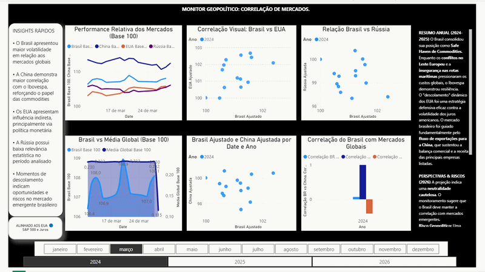

# analise-comparativa-ibovespa-mercados-globais
Monitor financeiro que utiliza as bibliotecas Pandas e YFinance para analisar dados históricos do Ibovespa e mercados internacionais.

📌 Problema de Negócio

Analisar como eventos geopolíticos recentes impactaram o comportamento do Ibovespa em comparação com mercados globais, considerando períodos de instabilidade internacional.

📊 Dados Utilizados

S&P 500 (EUA)

Shanghai Composite (China)

MOEX Russia Index (Rússia)

Ibovespa (Brasil)

Fonte: Yahoo Finance / APIs financeiras

🛠️ Ferramentas Utilizadas

Python (Pandas, Matplotlib, Seaborn)

Power BI

Excel / CSV

📈 Principais Insights

O IBOV apresenta maior correlação com o mercado americano (S&P 500)

Mercados emergentes apresentam maior volatilidade

Eventos globais impactam simultaneamente múltiplos mercados

💡 Conclusão

A análise indica que eventos geopolíticos recentes coincidem com aumentos significativos de volatilidade nos mercados globais. O Ibovespa demonstrou maior sensibilidade a esses eventos em comparação com mercados desenvolvidos, enquanto índices diretamente afetados apresentaram comportamentos mais extremos e descolados.

